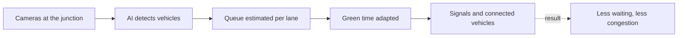
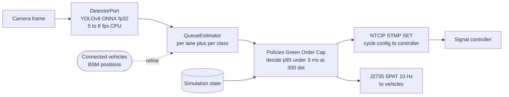
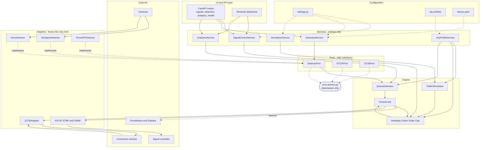
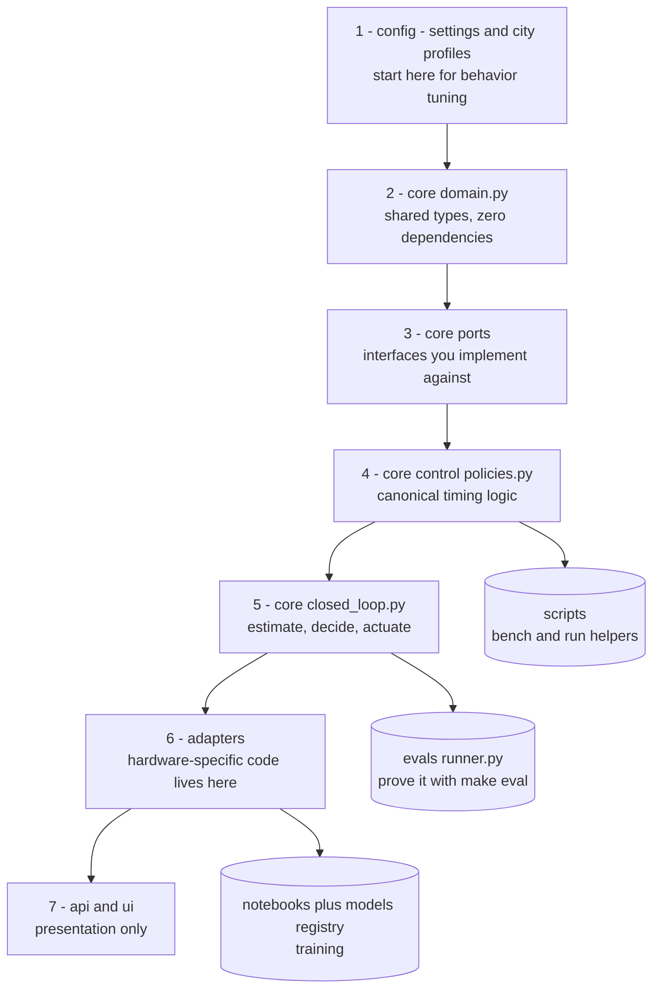

# Architecture Overview

**Last Updated:** 2026-09-22 — diagrams are Mermaid and render natively on GitHub. Four views, pick yours:

1. [System at a glance](#1-system-at-a-glance) — non-technical, 30 seconds.
2. [Frame-to-green journey](#2-frame-to-green-journey) — how it works, with measured numbers.
3. [Layered system view](#3-layered-system-view) — for implementers (ports, adapters, dependency rule).
4. [Code map for contributors](#4-code-map-for-contributors) — which file to open first (boxes link to source).

## 1. System at a glance



## 2. Frame-to-green journey

Numbers are measured, not targets — see `docs/BENCHMARKS.md`.



## 3. Layered system view



## 4. Code map for contributors

Read in numbered order. Click any box to open the source.



## Dependency Rule

```
core/domain.py ← ports ← adapters
```

- **domain.py**: Pure dataclasses, no external deps
- **ports/*.py**: Abstract interfaces (ABCs)
- **adapters/*.py**: Concrete implementations
  - Heavy libs (torch, ultralytics, onnxruntime) ONLY inside adapters
  - UI/API import services and `config.settings` only
  - No cross-imports between UI/API/engine internals

## City Profile System

Single source of truth for city-specific parameters:

| Parameter | Mumbai | Delhi | Bangalore | Tier2 Default |
|-----------|--------|-------|-----------|---------------|
| Lanes/Approach | 4 | 4 | 3 | 3 |
| Behavior Preset | aggressive_metro | typical_urban | typical_urban | typical_urban |
| Weather Profile | heavy_monsoon | clear | light_rain | clear |
| Vehicle Mix | 2W heavy | 2W + Auto | 2W dominant | balanced |
| Signal Bounds | 15-90s | 15-80s | 10-70s | 10-60s |

**Runtime Selection**: `CITY_PROFILE` env var → `settings.city` → `get_city_profile(name)`

**Wiring Points**:
- QueueEstimator: vehicle lengths, detector calibration, px_to_m
- Controllers: min/max green, yellow, all-red, directions
- Simulation: behavior preset, weather state, vehicle properties, generation rates
- RobustnessEvaluator: incident weights
- Detectors: class mapping, per-class confidence thresholds

## NTCIP 1202 / J2735 V2X Integration

### STMP (Actuation) - UDP Port 5000
- **SET**: phase timing (green/yellow/red per phase), cycle length, offset
- **GET**: current phase timing state
- OIDs: phaseGreen, phaseYellow, phaseRed, cycleLength, offset
- Graceful degradation: logs failure → local simulation mode

### SNMP (Monitoring) - UDP Port 161
- Detector status: volume, occupancy, fault
- Fault table: code, description, severity
- Cycle counters: cycle number, phase, green elapsed
- Non-blocking: failures logged but don't block control loop

### J2735 V2X - UDP Ports 1735/1736
- **BSM Receive (1735)**: Vehicle position/speed/heading → queue refinement
- **SPAT Transmit (1736)**: Signal phase/timing → connected vehicles (10Hz)
- **MAP**: Static intersection geometry loaded from city profile
- Best-effort broadcast

## Detection Pipeline

```
Camera Frame → DetectorPort.create(backend, city_profile) 
    → UltralyticsDetector / OnnxDetector 
    → detect(frame) → DetectionResult[VehicleDetection]
        → QueueEstimator.estimate_from_detections()
            → LaneQueue / QueueEstimate (per-direction)
                → Controller.compute_timing(TrafficState)
                    → SignalTiming → NTCIP STMP SET → Controller
                    → J2735 SPAT → Connected Vehicles
```

**Backends**:
- `ultralytics` (default): YOLOv8, PyTorch, GPU/CPU
- `onnx`: ONNX Runtime int8/fp32, CPU/CUDA/NPU
- `tensorrt`: TensorRTDetector (ORT TRT-EP fp16, engine cache); onnx fallback when provider absent

## Signal Timing Pipeline (policies — screenshot-in → green-out)

```
Screenshot/approach (all-red) → DetectorPort.detect
    → QueueEstimator.estimate_from_detections → QueueEstimate{by_direction, by_class}
        → inject_estimate (typed sim vehicles; all-CAR fallback)
            → GreenPolicy (weighted discharge: startup + Σ n_class × h_class, city headways)
            → CapPolicy (dynamic demand-share ceiling from cycle_budget_s)
            → OrderPolicy (clockwise right-hand rule + zero-skip; argmax via flag)
                → Priority: manual protocol (route-scoped, suppresses EVP there)
                  > EVP preempt > adaptive plan
                    → NTCIP STMP SET → Controller (+ J2735 SPAT)
```

- Ports + default adapters live in `core/control/policies.py`; engine holds
  injected policies (`green_policy`/`order_policy`/`cap_policy` config keys,
  legacy = `flat`/`argmax`/`fixed_max`). `HeadwayTable` merges
  `CityProfile.discharge_headways` over PCE defaults — per-city calibration is
  data, never code.
- `core/control/controllers.py` (Fixed/Webster/Fuzzy/DQN) is **dormant**:
  alternative `compute_timing` implementations, unwired from eval/closed-loop;
  Webster remains the documented fallback pattern.
- `CoordinationPort` (`Independent` = standalone today) is the MARL slot: a
  future coordinator biases `cycle_budget_s`/offsets per cycle, never phases.

## Simulation & Evaluation

### TrafficSimulation
- N-way intersection via compatibility graph scheduler
- Adaptive scheduling: max-demand group served
- 3 behavior presets × 4 weather states × incidents
- True vs observed queue (detection degradation modeled)

### Eval Matrix (make eval)
- 11 scenarios × 2 modes (adaptive vs fixed)
- Dimensions: geometry × discipline × weather × incident
- Metrics: avg wait, throughput, queue_error
- Regression flag vs previous scorecard

## Hardware Tiers (configs/device.yaml)

| Tier | Backend | Model | Quantization | Target FPS |
|------|---------|-------|--------------|------------|
| low  | onnx    | india-yolov8n-final | int8  | 5  |
| mid  | onnx    | india-yolov8n-final | fp32  | 15 |
| high | tensorrt (fp16 + engine cache; onnx fallback off-Jetson) | india-yolov8n-final | fp16 on Jetson | valid. pending HW |

## Verification Commands

| Command | Purpose |
|---------|---------|
| `make loop-fast` | Unit + integration tests (<30s) |
| `make verify` | Full test suite + lint + type-check |
| `make bench-sim` | Simulation throughput (steps/sec) |
| `make bench-detect` | Detection FPS/latency |
| `make eval` | Scenario matrix adaptive vs fixed |
| `make graph-update` | Refresh knowledge graph |

## Key Files

| File | Purpose |
|------|---------|
| `core/domain.py` | Shared domain types |
| `core/ports/ntcip_port.py` | NTCIP + J2735 port interfaces |
| `core/ports/detector.py` | DetectorPort ABC |
| `adapters/__init__.py` | Adapter factories |
| `config/city_profile.py` | CityProfile schema |
| `config/city_profiles.py` | Profile registry + JSON loader |
| `config/city_profiles/*.json` | 4 city profiles |
| `core/analytics/queue_estimator.py` | Queue length estimation |
| `core/analytics/robustness_eval.py` | Robustness evaluation |
| `core/control/controllers.py` | Signal controllers |
| `core/simulation/engine.py` | Microscopic traffic simulation |
| `core/detection/adapters_*.py` | Detection backends |
| `api/routes/signals.py` | REST + NTCIP/J2735 endpoints |
| `evals/runner.py` | Eval matrix runner |